CMV NGS Data Analysis
================
Osman Merdan
2023-04-27

## Brief Summary of Data And Data Source

------------------------------------------------------------------------

This is a personal project. The motivation for this project is to learn
new bioinformatics skills related to viral research and expand my
knowledge. This project analyzes CMV (Human betaherpesvirus 5) genomic
data related to congenital infections. Data analysis comprises finding
drug resistance mutations, CMV genotyping, and phylogenetic analysis of
samples.

Raw sequence data used in this project has been previously shared in
NCBI-SRA by the University of Glasgow (HCMV_Congenital_Collection) under
the BioProject Accession Number PRJEB48078
(<https://www.ncbi.nlm.nih.gov/bioproject/PRJEB48078>). This BioProject
contains 3 Genomic DNA submitted by Salvatore Camiolo (University of
Glasgow, School of Infection & Immunity). Instrument used was Illumina
MiSeq in PRJEB48078. And researchers used hybrid selection as a
selection method.

All bash and R-scripts and python notebooks related to the current
project have been shared in the GitHub repository
<https://github.com/osmanmerdan/Congenital-CMV>. Tool parameters have
been explained in detail in scripts files.

This project *does not* aim to find optimal best practices to analyze
CMV NGS data. For readers who are interested in a user-friendly, fast,
all-in-one solution to analyze the CMV genome, please check
GRACy(@camiolo_gracy:\_2021). This HTML document was created using
RMarkdown. Plots were created using the ggplot package if otherwise are
not indicated.

## CMV Viral Particle

------------------------------------------------------------------------

Human cytomegalovirus formally known as Human Herpes Virus 5 (HHV5) is a
member of *Herpesviridae* family. HHV-6, HHV-7, and CMV are classified
as *betaherpesviruses*.

Complete HCMV particles have a diameter of 120-200 nm. HCMV nucleocapsid
encircles large (220- to 240-kb) linear double-stranded DNA genome.
Outside of nucleocapsid there is matrix and a surrounding
phospholipid-rich envelope.

The HCMV genome is the largest among herpesviruses. It consists of more
than 170 nonoverlapping ORFs (Open Reading Frames). Genome encodes
structural, regulatory and immune modulatory proteins.

CMV is one of most important pathogenes causing congenital infections
ultimately leading sensorineural hearing loss and neurodevelopmental
problems.

HCMV DNA enters the host cell in linear form. HCMV genome has an
unpaired base at each end which facilitates circularization of the
genome which enables rolling circle replication. This replication
mechanism creates genome length covalently linked copies of viral genome
which are called concatemer. Concatemers are later cleved.

HCMV genome has class E organization with two domains that can be
inverted relative to each other *(Fig 1)*. That organization yields
equal amounts of four genomic isomers that can be isolated from samples.
These two domains are the long and short genome segments (L and S). Each
domain contains a unique central region (UL and US). Those regions are
flanked by repeated components that reside at either the terminal
regions of the genome (TRL and TRS) or intersection of L and S segments
(IRL and IRS). General organization of HCMV genome is TRL-UL-IRL
-IRS-US-TRS. Terminal end internal repeats shares a region of couple of
hundreds bps, called *a* sequence.

Fig 1: CMV wild type Merlin strain structure and possible isomers

## Quality Control Of Trimmed and Filtered NGS Data

------------------------------------------------------------------------

Paired end seqeunce data of 36 samples were downloaded from SRA using
sratoolkit (3.0.0) fastq-dump. Reads were timmed with Trimmomatic
(@bolger_trimmomatic:\_2014) (version 0.39). The minimum sequence length
was set to 200 bp. After Trimmomatic operations, FastQC (@464) and
MultiQC (@doi:10.1093/bioinformatics/btw354) were performed to get
summary statistics about raw-filtered NGS data.

The below table shows some of the summary statistics.  
  

    ## # A tibble: 72 × 18
    ##    Sample     Pair  `Total Sequences` Sequences flagged as p…¹ `Sequence length`
    ##    <chr>      <chr>             <dbl>                    <dbl> <chr>            
    ##  1 ERR7018437 1                242167                        0 200-251          
    ##  2 ERR7018437 2                242167                        0 200-251          
    ##  3 ERR7018441 1                165580                        0 200-251          
    ##  4 ERR7018441 2                165580                        0 200-251          
    ##  5 ERR7018443 1                  4508                        0 200-251          
    ##  6 ERR7018443 2                  4508                        0 200-251          
    ##  7 ERR7018450 1                533885                        0 200-251          
    ##  8 ERR7018450 2                533885                        0 200-251          
    ##  9 ERR7018455 1                403037                        0 200-251          
    ## 10 ERR7018455 2                403037                        0 200-251          
    ## # ℹ 62 more rows
    ## # ℹ abbreviated name: ¹​`Sequences flagged as poor quality`
    ## # ℹ 13 more variables: `% GC` <dbl>, total_deduplicated_percentage <dbl>,
    ## #   avg_sequence_length <dbl>, basic_statistics <chr>,
    ## #   per_base_sequence_quality <chr>, per_sequence_quality_scores <chr>,
    ## #   per_base_sequence_content <chr>, per_sequence_gc_content <chr>,
    ## #   per_base_n_content <chr>, sequence_length_distribution <chr>, …

  
  

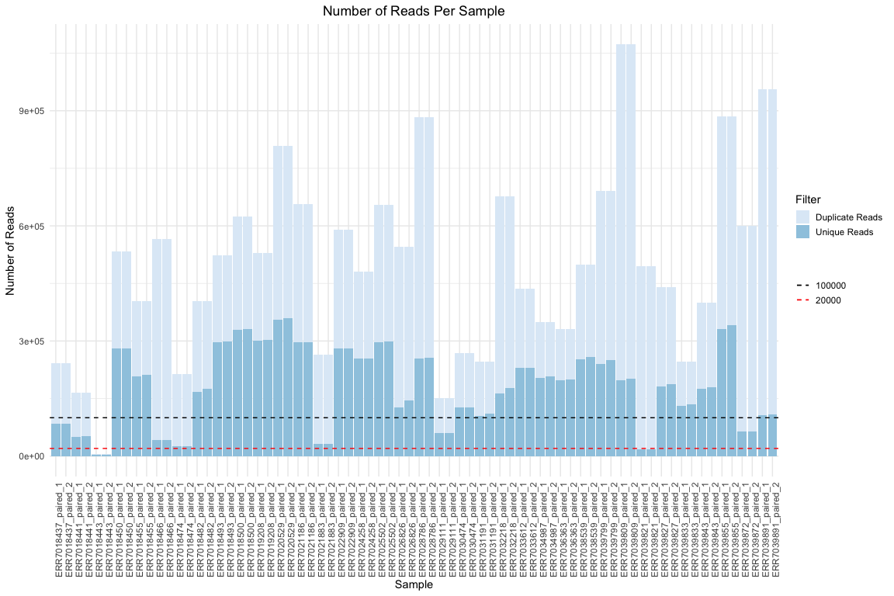

Plot 1: The number of unique and duplicated reads in each trimmed
sequencing record, estimated by FastQC.

  
  
HCMV *wild-type* strain Merlin genome size is 235646 bp. To achieve
reliable results from the variant analysis, at least a 20 bp coverage
threshold has been set in present NGS data analysis project. That means
at least 20000 (200bp long) reads are needed *(red line in the Plot 1)*.
Some of the low unique read count samples are:  
  

    ## # A tibble: 10 × 3
    ##    Sample              Filter       `Number of Reads`
    ##    <chr>               <chr>                    <dbl>
    ##  1 ERR7018443_paired_1 Unique Reads              3607
    ##  2 ERR7018443_paired_2 Unique Reads              3626
    ##  3 ERR7018466_paired_1 Unique Reads             41126
    ##  4 ERR7018466_paired_2 Unique Reads             42009
    ##  5 ERR7018474_paired_1 Unique Reads             25906
    ##  6 ERR7018474_paired_2 Unique Reads             25892
    ##  7 ERR7021883_paired_1 Unique Reads             32109
    ##  8 ERR7021883_paired_2 Unique Reads             32396
    ##  9 ERR7039821_paired_1 Unique Reads             16779
    ## 10 ERR7039821_paired_2 Unique Reads             16841

  
  

Fig 2: ERR7018443 (red) and other samples’ percent GC contents (gray).

  
  
HCMV Merlin strain genome has a GC content of %57. All the samples had
some level of deviation from the expected %57, which several issues like
contamination, PCR bias, low genome coverage, and hypervariable regions
in the CMV genomes may have caused *(Fig 2)*.

Mean quality scores were sufficient enough for downstream analysis *(Fig
3)*.  
  

Fig 3: Base quality

  
  

## Alignment Results

------------------------------------------------------------------------

Reads were aligned to *Human herpesvirus five strain Merlin, complete
genome* (GenBank Accession: AY446894.2) using BWA-MEM
(@li_aligning_2013) (Version: 0.7.17-r1188). Alignment files were
filtered and sorted using Samtools (@10.1093/gigascience/giab008)
(Version: 1.16.1). Output bam files were de-duplicated using Picard
MarkDuplicates (@Picard2018toolkit).  
Some important summary results from de duplicated-bam alignment files
were presented below.  
  

    ## # A tibble: 36 × 10
    ##    sampleID   name  start    end numreads covbasses coverage meandepth meanbaseq
    ##    <chr>      <chr> <dbl>  <dbl>    <dbl>     <dbl>    <dbl>     <dbl>     <dbl>
    ##  1 ERR7018437 AY44…     1 235646   133542    223758     95.0   135.         37.1
    ##  2 ERR7018441 AY44…     1 235646    74567    226520     96.1    75.9        37.2
    ##  3 ERR7018443 AY44…     1 235646     1080    129090     54.8     1.04       36.9
    ##  4 ERR7018450 AY44…     1 235646   927915    224058     95.1   919.         37  
    ##  5 ERR7018455 AY44…     1 235646   508385    224345     95.2   507.         37  
    ##  6 ERR7018466 AY44…     1 235646    32915    224683     95.3    33.1        37.2
    ##  7 ERR7018474 AY44…     1 235646      920     91605     38.9     0.799      37  
    ##  8 ERR7018482 AY44…     1 235646   339374    222538     94.4   338.         37  
    ##  9 ERR7018493 AY44…     1 235646   967097    222976     94.6   954.         36.6
    ## 10 ERR7018500 AY44…     1 235646  1150628    224520     95.3  1134.         36.7
    ## # ℹ 26 more rows
    ## # ℹ 1 more variable: meanmapq <dbl>

  
  
Samples with mean depth lower than 20 or coverage lower than 90% were
listed below.  
  

    ## # A tibble: 5 × 10
    ##   sampleID   name   start    end numreads covbasses coverage meandepth meanbaseq
    ##   <chr>      <chr>  <dbl>  <dbl>    <dbl>     <dbl>    <dbl>     <dbl>     <dbl>
    ## 1 ERR7018443 AY446…     1 235646     1080    129090     54.8     1.04       36.9
    ## 2 ERR7018474 AY446…     1 235646      920     91605     38.9     0.799      37  
    ## 3 ERR7021883 AY446…     1 235646    16116    222469     94.4    15.9        37.1
    ## 4 ERR7029111 AY446…     1 235646    13365    226233     96.0    13.2        37  
    ## 5 ERR7039821 AY446…     1 235646     5879    212631     90.2     5.53       37.2
    ## # ℹ 1 more variable: meanmapq <dbl>

  
  

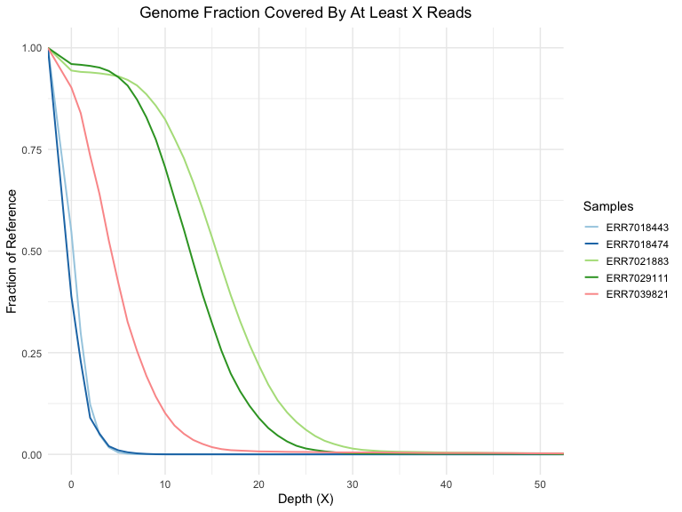

Plot 2: Empirical cumulative density function (complementary)
visualization for low-coverage low-mean-depth samples

  
  
ERR7018474 and ERR7018433 could cover 50% of the reference genome with
depth(X)≥1 *(Plot 2)*. Five samples (ERR7018443, ERR7018474, ERR7021883,
ERR7029111, ERR7039821) had low coverage and low depth across the genome
*(Fig 4)*. A large chunk of the reference genome had depth(X)\<20 for
these five samples *(Plot 2)*. They were not further processed.  
  

Fig 4: Depth of coverage heat map with log transformed values

  
  
There were three regions not covered in any sample, in the beginning, at
the end, and around the 200000th position *(Fig 4)*. Those regions
correspond to TRL, TRS, IRS, and IRL regions in AY446894.2, which are
listed below.  
  

    ## # A tibble: 8 × 3
    ##   Name                     Location           `Repeat-Type`   
    ##   <chr>                    <chr>              <chr>           
    ## 1 TRL                      [0:1324](+)        inverted        
    ## 2 'a' sequence             [0:578](+)         direct, terminal
    ## 3 OriLyt-associated repeat [94058:94198](+)   None            
    ## 4 IRL                      [194343:195667](+) inverted        
    ## 5 IRS                      [195089:197626](+) inverted        
    ## 6 'a' sequence             [195089:195667](+) inverted        
    ## 7 TRS                      [233108:235646](+) inverted        
    ## 8 'a' sequence             [235067:235646](+) direct, terminal

  
  
However, there were indications of possible deletions around positions
6000 and 11000 *(Plot 3)*. Record ERR7036363 had zero depth in those two
regions *(Plot 3)*. ERR7032218 showed signs of deletion only around
position 11000. ERR7024258 was included for comparison.  
  

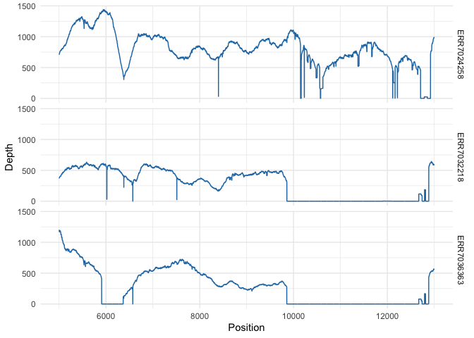

Plot 3 : Positions between 5000-13000 for samples ERR7036363,
ERR7032218, ERR7024258.

  
  
ERR7036363 showed significant sequence variation in the RL6 gene, as
indicated by soft-clipped reads *(Fig 5)*. That’s why ER7036363 had zero
reads mapped at corresponding positions. ERR7032218 has some SNPs and a
deletion in the RL6 gene *(Fig 5)*. ERR7024258 has nucleotide content
very similar to the Merlin strain at corresponding parts *(Fig 5)*.  
  

Fig 5: IGV snapshot zoomed in positions between 5600-6600

  
  
ERR7036363 and ERR7032218 showed significant sequence variation with
signs of possible deletion in regions corresponding to the genes RL11,
RL12, RL13, and UL1 *(Fig 6)*. In addition, ERR7024258 has many sequence
variations compared to the Merlin strain in these gene regions *(Fig
6)*.  
  

Fig 6: IGV snapshot zoomed in positions between 9000-14000

  
  
RL6, RL12, RL13, and UL1 genes are members of the RL11 gene family.
These regions are known for showing sequence variations between clinical
isolates. (@sijmons_genomic_2014, @dolan_genetic_2004)

In the *Fig4* positions between 180800 and 181300, there is a uniform
drop in the the number of reads mapped across the samples. However, some
samples had a second drop in the number of reads mapped around position
186800. ERR7025502 and ERR7039855 had zero mapped reads in the region
neighboring position 187500 *(Plot 4)*. ERR7025502, ERR7039855 and
ERR7019208 had zero reads mapped around position 181000 *(Plot 4)*.  
  

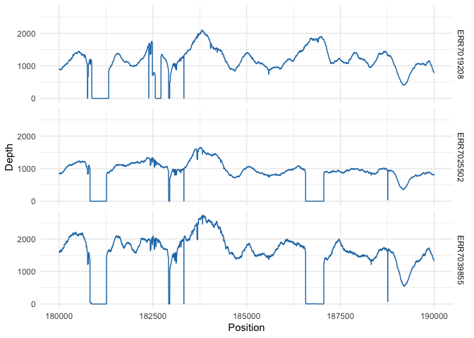

Plot 4: Positions between 180000-190000 for samples ERR7039855,
ERR7019208, and ERR7025502

  
  
UL146 gene has been shown to be particularly
variable.(@dolan_genetic_2004) *(Fig 7)*. ERR7025502, ERR7039855 and
ERR7019208 had soft clipped reads in UL146 region indicating large
amount of sequence variation between samples and reference Merlin strain
*(Fig 7)*.  
  

Fig 7: IGV snapshot zoomed in positions between 180600-181600

  
  
Another region showing sequence variation between different HCMV
clinical isolates is the UL139 region (@qi_human_2006). The alignment
status of reads belonging to ERR7025502, and ERR7039855 showed sequence
variation in UL139-150A regions *(Fig 8)*.  
  

Fig 8: IGV snapshot zoomed in the UL139 gene

  
  
In summary, CMV has a lot of regions that pose high levels of sequence
variation between clinical strains. Those regions could be rendered as
low-coverage, low-depth regions during alignment process.

## Variants

------------------------------------------------------------------------

Variants were called on deduplicated-bam files and filtered using
bcftools (version 1.16).(@li_statistical_2011). Later SnpEff database
for AY446894.2 was build following instructions shared on SnpEff
website.
(<http://pcingola.github.io/SnpEff/se_faq/#how-to-building-an-ncbi-genome-genbank-file>)
Variants in coding regions were annotated using SnpEff
(@cingolani2012program). Annotated variants were extracted with SnpSift
(@cingolani2012using). Number of different annotations were summarized
below table. *Note that beacuse the of overlapping genes and regions
below numbers are not exact representation of number of variants. During
the variant extraction process each variant extracted seperate rows to
enable quick downstream pprocess.*  
  

    ## # A tibble: 379 × 3
    ## # Groups:   SampleID, EFFECT [379]
    ##    SampleID   EFFECT             `Number of Variations`
    ##    <chr>      <chr>                               <int>
    ##  1 ERR7018500 synonymous_variant                   2287
    ##  2 ERR7019208 synonymous_variant                   2287
    ##  3 ERR7018493 synonymous_variant                   2284
    ##  4 ERR7020529 synonymous_variant                   2279
    ##  5 ERR7021186 synonymous_variant                   2277
    ##  6 ERR7034987 synonymous_variant                   2270
    ##  7 ERR7038539 synonymous_variant                   2270
    ##  8 ERR7039799 synonymous_variant                   2269
    ##  9 ERR7036363 synonymous_variant                   2266
    ## 10 ERR7033612 synonymous_variant                   2260
    ## # ℹ 369 more rows

  
  

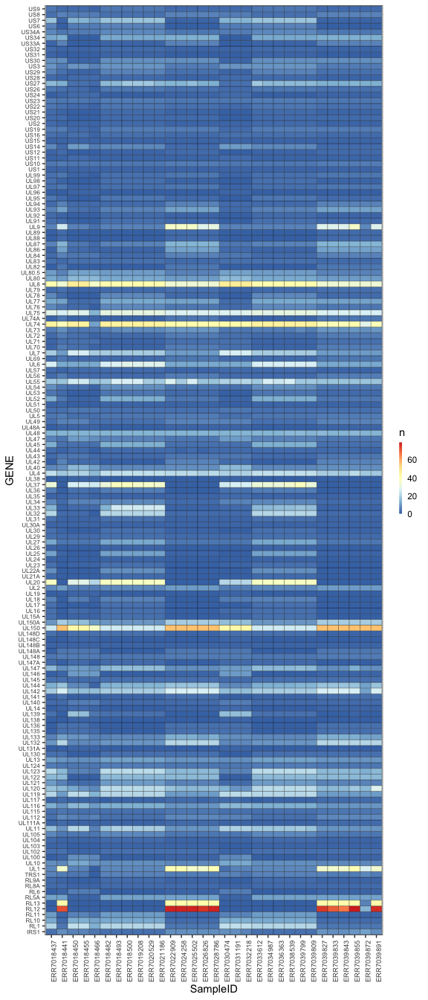

Plot 5: Heatmap summarizing number of non-synonymous SNPs for each
sample and gene combination

  
  
Some samples had a high number of non-synonymous SNPs at regions RL12
and RL13 *(Plot 5)*. However, nearly half of the samples had zero
non-synonymous SNP in RL12 and RL13 *(Plot 5)*. RL12 and RL13 bind Fc
portion of human IgG1 and IgG2.(@cortese_recombinant_2012) and they show
significant number of sequence variations between clinical strains.
Manually inspecting alignments files for the R12 and RL13 genes revealed
that some samples (e.g.ERR7018455) had no coverage in the region which
lead zero detected sequence variation *(Fig 9, Fig 10)*. Hypervariable
regions in HCMV genome leads to complicated alignments which can
significantly alter the sequence variation results.  
  

Fig 9: IGV capture for read alignments of the RL12 gene.

  
  

Fig 10: IGV capture for read alignments of the RL13 gene.

  
  

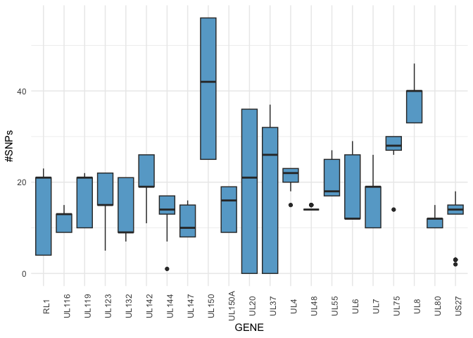

Plot 6: Box plots for some genes with more than ten mean-ci of
non-synonymous SNPs.

  
  
A higher number of non-synonymous SNPs were observed in UL8, UL74, UL75,
and UL150 genes *(Plot 5, Plot 6)*. The products of these genes were
summarized in the following table.  
  

    ## # A tibble: 40 × 4
    ##    Gene  Product                                                  Position Note 
    ##    <chr> <chr>                                                    <chr>    <chr>
    ##  1 RL1   RL1 family                                               [1366:2… prot…
    ##  2 RL5A  RL11 family                                              [5388:5… prot…
    ##  3 RL10  type 1 membrane protein; possibly related to RL11 family [8600:9… enve…
    ##  4 RL12  type 1 membrane protein; RL11 family                     [9849:1… memb…
    ##  5 RL13  type 1 membrane protein; RL11 family; consensus is wild… [11188:… memb…
    ##  6 UL1   type 1 membrane protein; RL11 family                     [12173:… memb…
    ##  7 UL4   contains signal peptide; RL11 family                     [13820:… enve…
    ##  8 UL6   type 1 membrane protein; RL11 family                     [14964:… memb…
    ##  9 UL8   type 1 membrane protein; RL11 family                     join{[1… memb…
    ## 10 UL7   type 1 membrane protein; modulates cytokine production;… [15864:… memb…
    ## # ℹ 30 more rows

  
  
UL74, and UL75 are involved in cell entry (@ye_functional_2020). UL74
and UL75 codes for envelope glycoproteins O and H, respectively. UL74 is
related to cell tropism and immunomodulation (@sijmons_genomic_2014).
UL74 region is also a hypervariable region. UL150 is involved in immune
regulation which can explain high number of non-synonymous SNPs.  
  

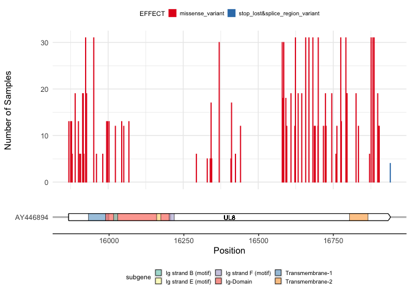

Plot 7: Number of samples with non-synonymous mutations per position in
the UL8 gene. Non-synonymous mutations were color coded. UL8 gene scheme
(Created by <https://github.com/wilkox/gggenes> package ) has been added
for interpretation.

  
  
Membrane glycoprotein 8 is the product of UL8. Each sample had 30 or
more non-synonymous SNPs in the UL8 gene *(Plot 6)*. UL8 is shown to be
able to reduce the production of pro-inflammatory cytokines
significantly. UL7 and UL8 share 195 amino acids (aa) long sequence,
which includes \~35 aa signal peptide and \~100 aa IgV-like domain
(@perez-carmona_prominent_2018). Previous studies have shown that. HCMV
strains has %79-%100 sequence identity and most of the sequence
variation in the UL8 gene has been observed in the stalk region which is
\~140 aa long. Similar results obtained from the variant analysis *(Plot
7)*. 3’ end of UL8 coding region showed high number of sequence
variations *(Fig 11)*.  
  

Fig 11: IGV capture for read alignments of the UL8 and neighbouring
genes.

  
  

## Drug Resistance Mutations

------------------------------------------------------------------------

Main drugs used to treat CMV infections are Ganciclovir, Foscarnet,
Cidofovir, Letermovir and Maribravir. UL54 (DNA polymerase) mutations
can alter Ganciclovir, Foscarnet and Cidofovir succeptibility. UL97
kinase mutations effect Ganciclovir and Maribavir succeptibility.
Maribavir and Letermovir resistance can arise because of the mutations
in UL27 or Terminase gene (UL56, UL89, UL51) respectively.

Annotated-VCF files were searched for the presence of known antiviral
resistance-related mutations using the Hrpesvirus Drug Resistance
Genotyping web server (<http://cmv-resistance.ucl.ac.uk/herpesdrg/>). No
antimicrobial resistance mutation has been found in any sample. One
exciting feature is that most samples have Gln126Leu and Asp605Glu amino
acid polymorphisms in the UL97 translated sequence \_(Plot8\_\_. Below
table summarizes detected polymorphisms by the server. Asp605Glu
polymorphism previously shown to be more prevalant in infants with
primary HCMV infection compared with HCMV recurrence in transplant
recipients (@sun_human_2012).  
  
  

    ## # A tibble: 38 × 39
    ##    sample change freq  genome_pos strand ref_codon var_codon ref_count var_count
    ##    <chr>  <chr>  <chr>      <dbl> <chr>  <chr>     <chr>         <dbl>     <dbl>
    ##  1 ERR70… UL97_… 100%      143612 +      GAC       GAG               0        97
    ##  2 ERR70… UL97_… 100%      142174 +      CAG       CTG               0        74
    ##  3 ERR70… UL97_… 100%      142174 +      CAG       CTG               0        33
    ##  4 ERR70… UL97_… 100%      143612 +      GAC       GAG               0       322
    ##  5 ERR70… UL97_… 100%      142174 +      CAG       CTG               0       174
    ##  6 ERR70… UL97_… 100%      143612 +      GAC       GAG               0       763
    ##  7 ERR70… UL97_… 100%      142174 +      CAG       CTG               0       511
    ##  8 ERR70… UL97_… 100%      143612 +      GAC       GAG               0       764
    ##  9 ERR70… UL97_… 100%      142174 +      CAG       CTG               0       594
    ## 10 ERR70… UL97_… 100%      143612 +      GAC       GAG               0       684
    ## # ℹ 28 more rows
    ## # ℹ 30 more variables: consequence <chr>, mutation_id <dbl>, virus <chr>,
    ## #   genotype <lgl>, gene <chr>, aa_change <chr>, Ganciclovir <chr>,
    ## #   Aciclovir <lgl>, Cidofovir <lgl>, Foscarnet <lgl>, Brincidofovir <lgl>,
    ## #   Letermovir <lgl>, Brivudine <lgl>, Pencyclovir <lgl>, Tomeglovir <lgl>,
    ## #   Maribavir <lgl>, Cyclopropavir <lgl>, Amenamevir <lgl>, ref_title <chr>,
    ## #   ref_link <chr>, ref_doi <chr>, strain_generation <chr>, …

  
  
No previous literature record was found for Thr75Ala amino acid
variation in UL97 translated sequence. However, it was present in 31
samples *(Plot8)*. Other mutations in UL97 were already mentioned in the
literature and are frequently found in clinical samples.
(@lurain_antiviral_2010) Characterized  
  

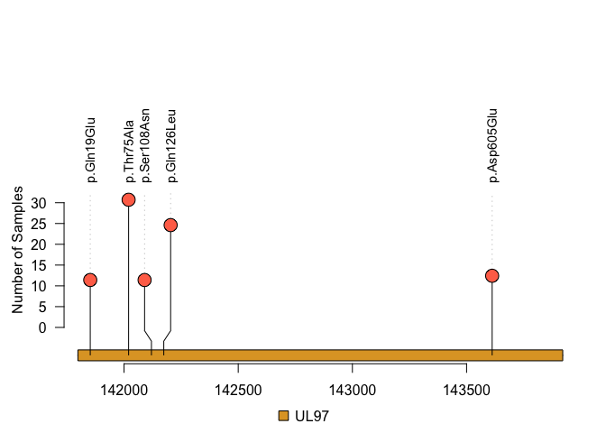

Plot 8: UL97 gene representation with detected non-synonymous mutations.
It is shown in the y-axis how many sampless have mutations. (Created by
using <https://github.com/jianhong/trackViewer> package)

  
  
No previous literature record was found for Gln339Arg and Thr1122Ile
amino acid changes in UL54 translated sequence *(Plot 9)*. Number of
samples has two SNPs (HGVS_C notation c.3365C\>T, c.3364A\>G) (Ref Pos
78558 G-\>A and Ref Pos 78559 T -\> C) affecting codon corresponding to
amino acid at position 1122 in UL54 protein *(Fig 12 and Fig 13)*. Those
two SNPs were pictured as two different amino acid changes (Thr1122Ile
and Thr1122Ala) in the annotated vcf files. But combined effect of two
SNPs resulted in a codon change from ACC to GTC which actually caused
Thr1122Val. There were also some samples with neither of mutations
(Thr1122Ile and Thr1122Ala).  
Gln339Arg was found in five samples. Remaining mutations were
characterized by other researchers.(@lurain_antiviral_2010)  
  

Fig 12: Graphic for Merlin Strain UL54 protein sequence. (From NCBI)

  
  

Fig 13: Alignment of reads for sampme ERR7021186. 78558G-\>A and 78559T
-\> C mutations present in one sample

  
  

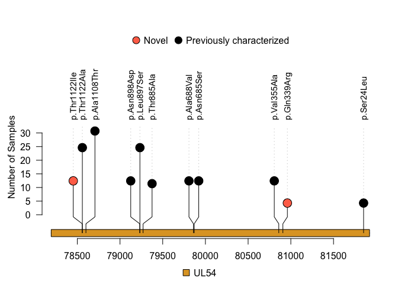

Plot 9: UL54 gene representation with detected non-synonymous mutations.
It is shown in the y-axis how many samples have mutations.(Created by
using <https://github.com/jianhong/trackViewer> package)

  
  
There was no resistance related mutations in UL56, UL51, UL89, UL27
genes. Some missense variations were present in nearly all samples
*(Plot 10)*.  
  

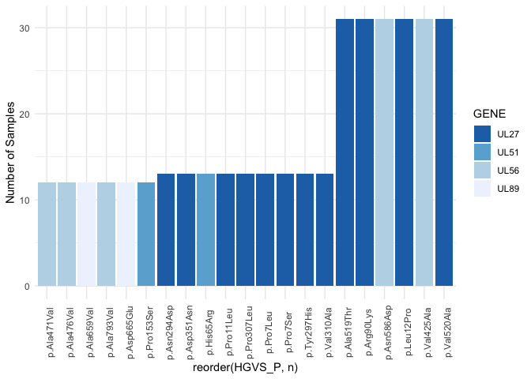

Plot 10: Number of samples with detected missense variations in UL56,
UL51, UL89, UL27 genes

  
  

## Genotyping

------------------------------------------------------------------------

The stain numbers were estimated following previously describes steps
(@suarez_human_2019, @govender_complexity_2022) using the miRNA_Search
program
(<https://github.com/centre-for-virus-research/VATK/tree/master/HCMV_pipeline>).
This program searches the presence of short motifs in the sequence data.
Previously listed short motifs has been used (@govender_complexity_2022,
Supplementary Tables). However, to minimise biases arised from sequence
duplciates FastUniq used to remove duplicate sequences from sequencing
reads (@xu_fastuniq:\_2012). At this step FASTQ files was turned into
FASTA format and later sequence identifiers removed before processing
files with miRNA_Search. Output files were parsed using a modified
version of perl script shared in HCMV_pipeline. Minimum number of reads
that carry one specific motif was set to 10 and the percetange treshold
for number of reads that carry any motif was set to 2%. Any genotype
motif that did not meet with this requirements was discarded. Motifs
representing RL5A, RL6, UL74, RL12, UL11, UL139, UL111A, UL9, UL146,
UL120, UL73, US9, RL13, UL1 regions were searched in the reads.

There was no sample which has more than one strain. Only one genotype
has been detected for each sample - variable gene
combinations(genotype_counts.txt file). Genes, genotypes, number of
reads carry that genotype motif and the percetage of reads were
summarized in table below.  
  

    ## # A tibble: 434 × 5
    ##    Region Genotype Percentage.of.Reads Num.of.Reads Sample    
    ##    <chr>  <chr>                  <dbl> <chr>        <chr>     
    ##  1 RL5A   G1                     100   "557 "       ERR7018437
    ##  2 RL6    G2                     100   "353 "       ERR7018437
    ##  3 UL74   G2B                    100   "432 "       ERR7018437
    ##  4 RL12   G4A                    100   "602 "       ERR7018437
    ##  5 UL11   G6                      99.8 "585 "       ERR7018437
    ##  6 UL139  G1A                    100   "407 "       ERR7018437
    ##  7 UL111A WT                     100   "300 "       ERR7018437
    ##  8 UL9    G9                     100   "541 "       ERR7018437
    ##  9 UL146  G13                    100   "289 "       ERR7018437
    ## 10 UL120  G1B                     99.5 "375 "       ERR7018437
    ## # ℹ 424 more rows

  
  
RL5A-G1, ULL11A-WT, and US9-WT were common elements in all samples. Two
different genotypes were spotted in UL9, UL11, UL1, RL6 regions
*(Plot11)*. Other regions were little bit more diverse regarding
genotypes.  
  
  

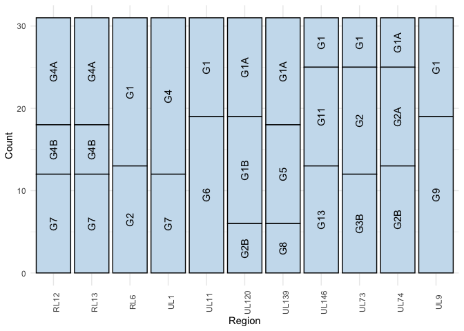

Plot 11: Counts for each genotype

